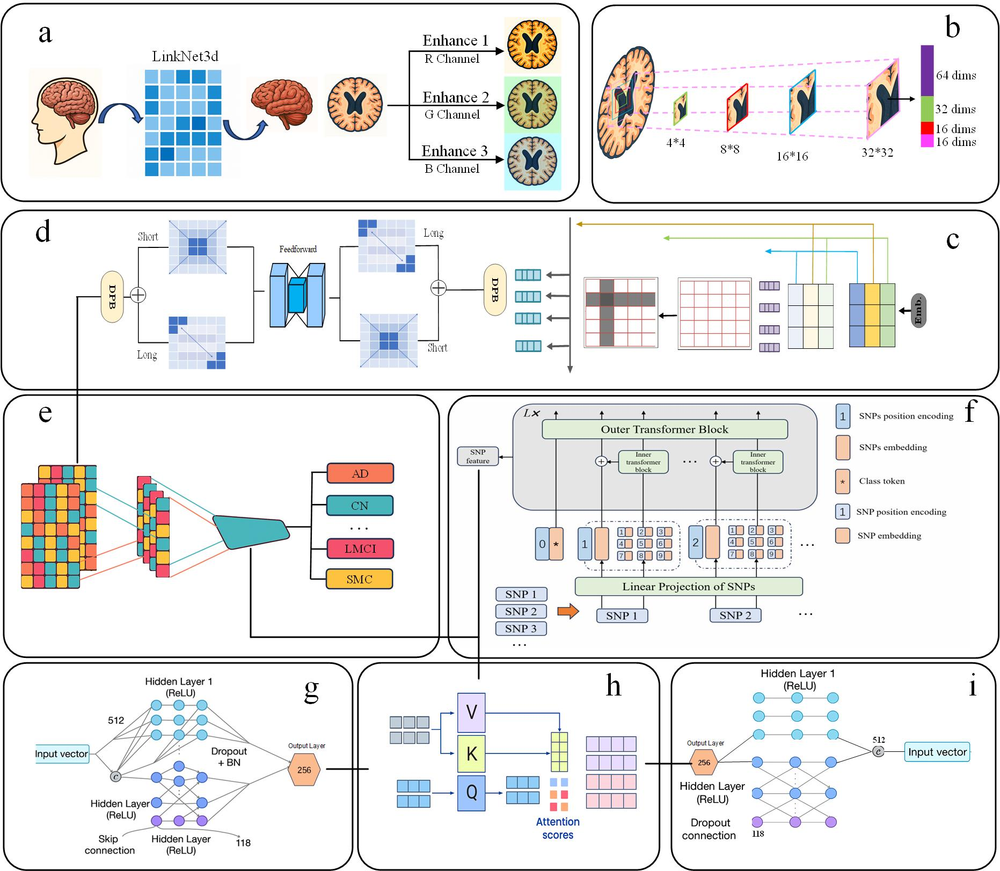

# CVTC-M: Multimodal Model for Alzheimer’s Early Diagnosis

#### Project Overview
This project develops a lightweight multimodal fusion model (CVTC-M) for the early diagnosis and conversion time prediction of Alzheimer’s disease (AD) by integrating MRI, protein concentrations, APOE genotypes, and SNP data. Leveraging an implicit time-series modeling approach with scale-adaptive embedding (SAE) and long-short attention mechanisms (LS-Transformer), the model enhances prediction accuracy while reducing computational complexity.

#### Features
- Multimodal Data Integration: Combines MRI images, protein concentrations, APOE, and SNP data for AD early diagnosis.
- Implicit Time-Series Modeling: Captures disease dynamics using final time-point labels without complex time-series alignment.
- High-Precision Prediction: Achieves 86.32% accuracy and 1.09-year MAE on ADNI, and 85.34% accuracy and 1.28-year MAE on NACC.
- Biological Mechanism Insights: Analyzes SNP-APOE and SNP-protein interactions, constructs an APOE-CLU-HSP60-BRCA1 network, and identifies potential biomarkers.
- Lightweight Design: Features ~6.51M parameters and 0.0207-second inference time, suitable for resource-constrained devices.

#### Method Description
##### Model Architecture
CVTC-M employs the following core components:
- **Scale-Adaptive Embedding (SAE)**: Processes input features with convolution kernels of varying scales, large kernels capture context, small kernels focus on local details, with a dimension ratio of 2 for efficiency.
- **LS-Transformer**: Integrates Dynamic Position Bias and long-short attention, with long attention capturing macroscopic anatomical relationships and short attention focusing on local microstructures.
- **Feature Extraction**:
  - MRI data processed via LinkNet3D for skull segmentation, enhanced by MBIE (red channel slight sharpening, green channel CLAHE, blue channel high-pass filtering).
  - Protein and APOE data extracted using MLP with skip connections for gradient stability.
  - SNP data processed by a Transformer module to capture long-range dependencies, enhanced by DPB for spatial associations.
- **Multimodal Fusion**: Uses Cross Attention to integrate features from four modalities into a global semantic representation.
- **Prediction Module**: Classification head predicts conversion types, regression head predicts conversion time, with logarithmic transformation to optimize large-scale training.



##### Implicit Time-Series Modeling
The model selects individuals with data from at least two time points, using the final time-point label as a supervisory signal to implicitly encode disease dynamics, avoiding the high computational cost of traditional time-series models.

##### Biological Analysis
- **SNP-Protein/APOE Association**: Reduces SNP features via PCA, constructs interaction terms (SNP_PCA * Protein), evaluates with SVM and logistic regression, and ranks key combinations by composite scores.
- **Brain Region-Transcriptome Association**: Identifies key genes via masking experiments, with 75.79% associations validated.
- **PPI Network**: Constructs an APOE-CLU-HSP60-BRCA1 network using STRING, BioGRID, and IntAct databases, validated by single-cell RNA-seq data.

#### Dataset Preparation
The `make_dataset.py` script processes raw MRI data from the input folder and generates preprocessed images in the output folder.

##### Usage
Run the script from the project directory:
```bash
python make_dataset.py --input_dir ./Dataset --output_dir ./Output
```
- Arguments:
  - `--input_dir`: Path to the input dataset folder (default: `./Dataset`).
  - `--output_dir`: Path to the output folder for preprocessed images (default: `./Output`).

##### Input Folder Structure
The input folder should follow this structure:
```
Dataset
├── 002_S_0295
│   ├── Any_file
│   │   ├── Detection_time
│   │   │   ├── Scan_ID
│   │   │   │   └── *.nii
├── 002_S_0413
│   ├── Any_file
│   │   ├── Detection_time
│   │   │   ├── Scan_ID
│   │   │   │   └── *.nii
├── ...
```

##### Output Folder Structure
The output folder will contain preprocessed images in the following structure:
```
Output
├── 002_S_0295{time}
│   └── *.png
├── 002_S_0413{time}
│   └── *.png
├── ...
```

#### Installation
1. Ensure Python 3.12.4 or higher is installed.
2. Clone the repository:
   ```bash
   git clone https://github.com/username/CVTC-M.git
   ```
3. Install dependencies:
   ```bash
   pip install pandas==2.2.2 numpy==1.26.4 scikit-learn==1.5.0 torch==2.5.0 scipy==1.14.0 nibabel==5.3.2 matplotlib==3.8.4
   ```
4. Install GPU-supported PyTorch (optional):
   ```bash
   pip install torch torchvision torchaudio --index-url https://download.pytorch.org/whl/cu121
   ```

#### Usage
1. Data Preparation: Place ADNI and NACC datasets in the `Associated` or `CVTC` folders, ensuring format compliance with the paper (MRI, SNP, APOE, protein data).
2. Run the Model:
   Navigate to the CVTC directory and run the main script:
     ```bash
   python main.py --data_path ./CVTC --output_dir ./results
     ```
   Arguments: `--data_path` is the input data path, `--output_dir` is the output results path.
3. Result Analysis: Outputs include conversion type predictions (accuracy, AUC) and conversion time predictions (MAE, etc.), detailed in the `results` folder.

#### Data and Dependencies
- Datasets: ADNI (377 patients for training, MRI, APOE, SNP, protein data) and NACC (100 patients for testing) datasets, available at [https://adni.loni.usc.edu/](https://adni.loni.usc.edu/) and [https://naccdata.org/](https://naccdata.org/). Single-cell RNA-seq data from GEO (GSE264648).
- Dependencies: Python 3.12.4, pandas 2.2.2, numpy 1.26.4, scikit-learn 1.5.0, PyTorch 2.5.0, etc., see installation guide for details.

#### Contributing
Contributions are welcome via Issues or Pull Requests! Please refer to the [Contributing Guidelines](CONTRIBUTING.md) for details.

#### License
This project is released under the [MIT License](LICENSE).

#### References
See the "References" section of the paper "CVTC-M: Multimodal Model for Alzheimer’s Early Diagnosis with Interaction Mechanism Insights" for details.
